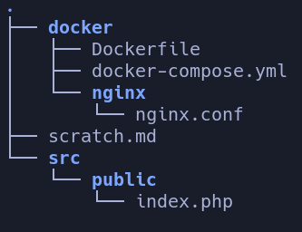

## Project Structure

### Start all docker containers, rebuild if necessary

    docker-compose  up -d --build

### Run docker containers

    docker-compose  up

### Enter an interactive shell session on running container

    docker exec -it <container-name> bash

### List all running containers

    docker compose ps

### Stop all running containers

    docker compose stop
